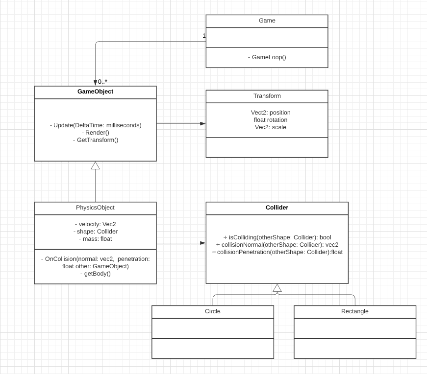

## Game Loop Design Pattern

https://gameprogrammingpatterns.com/game-loop.html

* Every `GameObject` is updated and rendered on every loop
* Physics are also calculated every-loop

### Structure

This is loosely based on how Unity does it

### Physics Engine

* [How to Create a Custom 2D Physics Engine: The Basics and Impulse Resolution](https://gamedevelopment.tutsplus.com/tutorials/how-to-create-a-custom-2d-physics-engine-the-basics-and-impulse-resolution--gamedev-6331)
* [How to Create a Custom 2D Physics Engine: The Core Engine]( https://gamedevelopment.tutsplus.com/tutorials/how-to-create-a-custom-2d-physics-engine-the-core-engine--gamedev-7493)
* [How to Create a Custom 2D Physics Engine: Friction, Scene and Jump Table](https://gamedevelopment.tutsplus.com/tutorials/how-to-create-a-custom-2d-physics-engine-friction-scene-and-jump-table--gamedev-7756) 

## Near Final Structure of GameObjects

