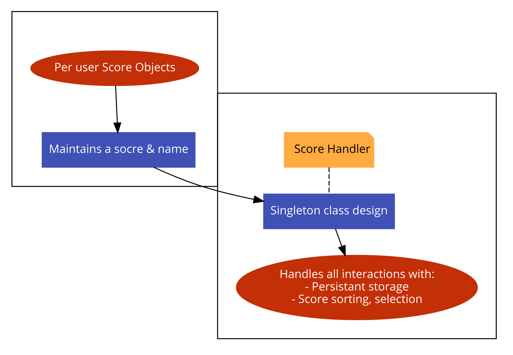

# ScoreHandler.java
---

Started, implemented & tested during sprint 1.

## Table Of Contents

- [Overview](#overview)
- [Design](#design)
- [Implementation & Testing](#implementation-testing)

---
### Overview

A singleton built on the premise of providing a simple, reliable and persistent class to handle all of the hard work needed to build and maintain a high score system. Simple method calls don't leave it up to the user to decide who, what, when and where. Rather, they provide the user with a straight forward means for implementing a scoring sysmtem.

---

### Design

Needs:
+ Persistent storage for top scores:

    In order to maintain a reliable scoring system, we will need to create and store a means of interacting with whatever android uses for file storage. Intial thoughts are Json/XML.
+ Sorted:

    This is a score system after all, it needs to be sorted. Ascending or descending comes down to further game planning.
+ Clean, following good practices:

    We aren't completely self-disrespecting. This code should be clean, separate class's where required and not make things overly complicated for the end user where applicable.

---

### Implementation & Testing

##### Score.java
A fairly simplistic class created to simply maintain a given *score* and *username* for each game player.

The implementation changed during the testing phase, but essentially everything is under get/set operations. The only major change during development was the addition of an AtomicInteger representing a *id* that corrosponds to each **Score**.
The reason for this change is mainly due to how the **ScoreHandler** was changed in regard to persistent storage of data, it became both cleaner and more reliable to store based off a unique *id* compared to a *username* or *score*, but I will touch on this more soon.

During initial creation, it is natural to set the user's *score* to 0, but what off a *username*? We can't leave it as null since *usernane* collection is not enforced in order to save anything, and forcing it will just create undue overcomplication to such a simple thing. The fix? Just set a default, I went with "Unknown User".

##### ScoreHandler.java
The **ScoreHandler** went through a couple of phases, during the initial phase I aimed to create a working class. Nothing fancy, just simply learn how to interact with Android persistant storage, store some **Score's**. Secondly was the main transition, this involved cleaning up the entire class of interactions. From moving to more reliable SharedPreference's interactions & an easier to use Singleton.

At the beginning, it was a simple class. Testing by this regard was also simple however I did run into some crucial issues that revolved around my current approach. Namely, the ability to work with SharedPreferences & maintain some form of context without running into MemoryError's. This involved a lot of trial and error, attempt to save something, have it not work, go back and rinse and repeat. Eventually this was solved, however the approach taken was less then simplistic or inline with our design goals for this system. This is one of the main things that prompted me to look out further in an attempt to find some form of 'cleaner code' that would allow me to 'kill two birds with one stone essentially'. Both fixing my SharedPreferences issues as well as cleaning up some bugs that occured due to my Context usage. Once implemented the system worked smoothly, and is still the current underlying persistent storage method used in our game.

Another issue that cropped up, quite quickly after the move to a default *username* in **Score** was that SharedPreferences is basically Json in that its `key:value`. You should be able to see quite quickly where this is heading haha, I was failing to check agaisnt *username's* for uniqueness and thus, only actually saving one *username* at a time as it was merely overwriting the *score* field. Initially the fix for this was a couple of methods which turned the *username* into a unique string based off an `int`. Given how over the top this was, the move was made to simply making each **Score** maintain an AtomicInteger as an id and saving any scores using that as a key, because it is guarenteed to be unique. Once the underlying logic was rebased to a `{Int id: [String score, String username]}` overview everything was quite smooth although it now meant we couldn't use a `TreeMap` to automatically store & sort the scores.

In order to solve this issue, because it did indeed need to be solved to meet both our sprint design and well, its a score system, I needed to change up our **Score** class to make it comparable. This was quite a simple addition, merely doing some math based on each class's *score* which allows us to sort in ascending order correctly. Once this had been implemented and tested all that was left was to store an ArrayList of **Score's** and then called Collections.sort on our ArrayList to receive the list sorted into ascending order.

