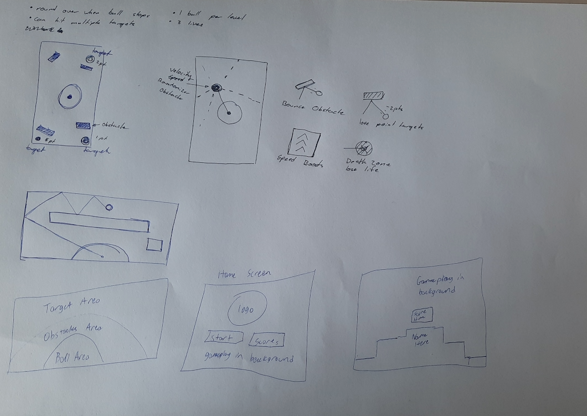

## Testing Log

|                                                              |                                                              |
| :----------------------------------------------------------- | ------------------------------------------------------------ |
|   | Initial paper-prototype and brain storm                      |
|   | Backlog in trello                                            |
|  | Game loop test. Drawing and updating 500 circles of random size |
|   | Early throwing testing.  Ball vs Ball                   |
|  | Rectangle VS Ball testing                                    |
|  | Debugging rectangle rotation and collisions.                 |
|   | Further sprint progression                      |
|                                                              |                                                              |
